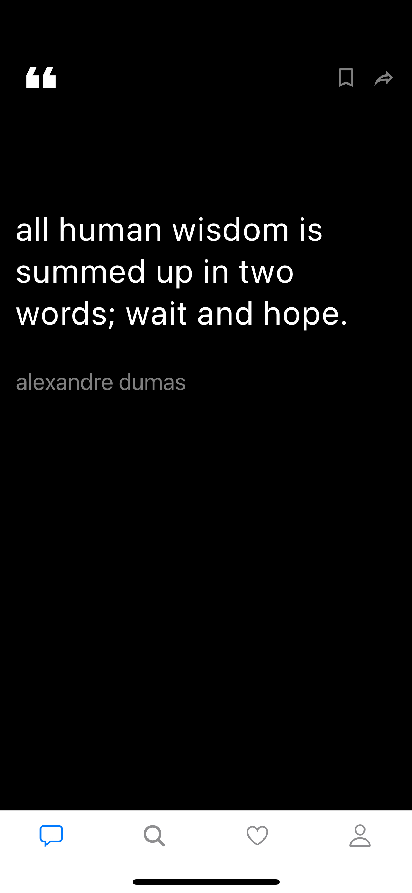
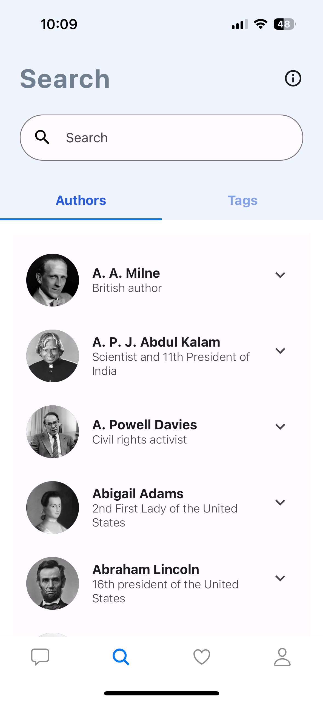
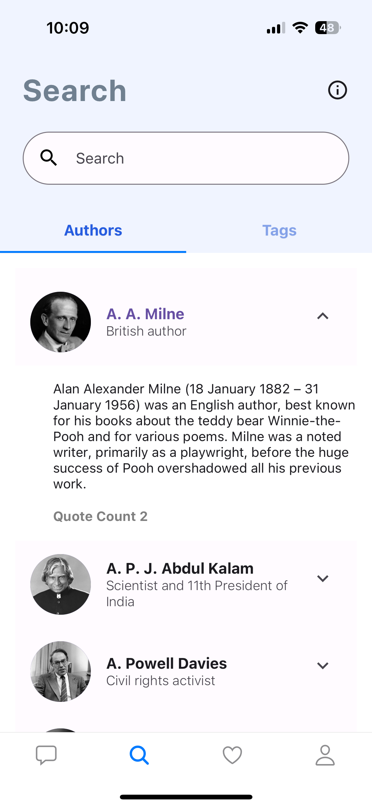
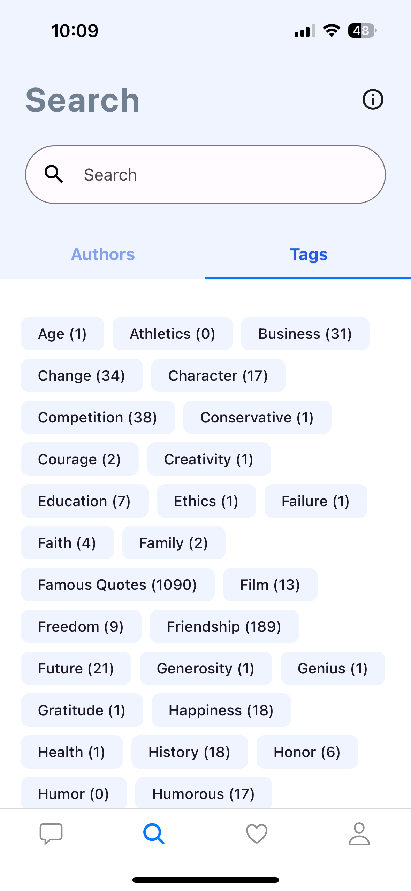
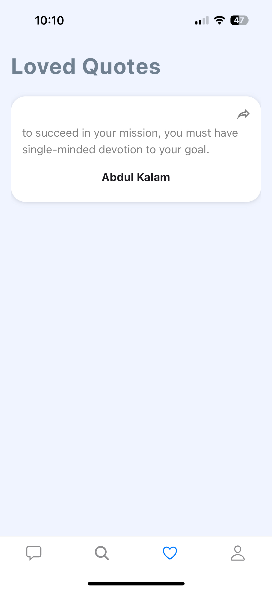

# Group25 Tech For Mobile Application - Random Quote Generator App

A simple React Native app built with Expo that displays random quotes from Indian Authors and Famous people.

## Getting Started
 It's a simple and basic application to get daily Quations from famous author.

### Prerequisites

no Prerequisities required

### TeamMates

**Names**

1. Neeraj Kasheety 
2. Sai Akshay Thota
3. Bharath varma Penumatcha

### Development Setup

Run the following command:

```bash
npm install -g expo-cli
git clone https://github.com/yogeshwar-chaudhari-20/RandomQuotes
cd RandomQuotes
npm install
npm run start
```

Use your preferred method to run the app on an emulator, simulator, or physical device.

## Additional Information

## Functionality
- **Random Quotes**: Display daily motivational quotes prominently in large text, along with the name of the author.
- **Author List**: Present a list of authors, allowing users to search for specific authors.
- **Author Details**: Expandable list items reveal additional information about the author, including their biography and the total count of quotes.
- **Tag List**: Showcase a list of tags associated with the respective count of quotes.
- **Bookmarked Quotes**: Display quotes bookmarked by the user for easy access.

## Technologies Used
- **JavaScript (JS)**: The primary language used for building the React Native application.
- **React Native**: A framework for building native mobile applications using JavaScript and React.
- **TypeScript**: Optionally used for type safety and improved developer experience.
- **Node.js**: Used for backend development and package management.
- **Expo**: A platform for building and deploying React Native applications.
- **GitHub**: Version control system for collaborative development and code management.
- **Visual Studio Code (VSCode)**: Preferred Integrated Development Environment (IDE) for React Native development.


## Screenshots

1. **Home:**
   <br/>
   

   The quote is displayed prominently in large text, and it is succeeded by the name of the author.

2. **Screenshot 2:**
   <br/>
   

   Presenting a list of authors, with the added functionality for customers to search for a specific author.

3. **Screenshot 3:**
   <br/>
   
cd
   Expanding the list item reveals additional information, including the author's biography and the total count of quotes.

4. **Screenshot 4:**
   <br/>
   

   A list of tags is showcased along with the respective count of associated quotes.

5. **Screenshot 5:**
   <br/>
   

   Displays the quotes bookmarked by the customer.
